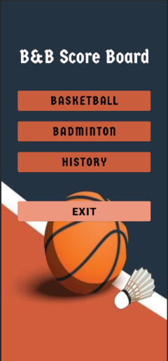
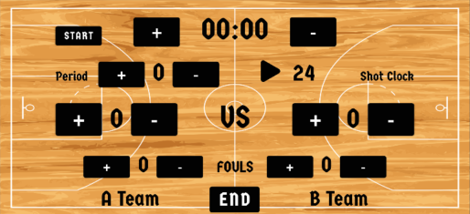
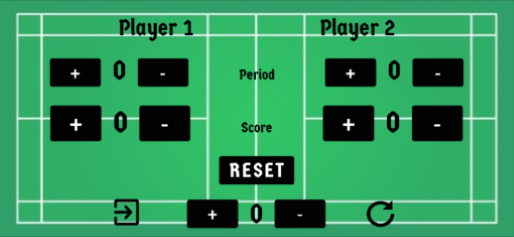

# B&B ScoreBoard

B&B ScoreBoard is an Android application to track and review scores for basketball and badminton matches. This repository contains the Android app module and Gradle build files.

## Project structure

- `app/` — Android application module
  - `src/main/java/` — Java source code (activities and app logic)
  - `src/main/res/` — Resources (layouts, strings, drawables)
  - `src/main/AndroidManifest.xml` — App manifest (package: `com.ls.bbscoreboard`)
  - `build.gradle` — Module build configuration (compileSdk, dependencies)
- `build.gradle` (root) — Top-level Gradle configuration and plugin versions
- `settings.gradle` — Project name and modules

## Prerequisites

- JDK 11 or compatible (Java 8 language level is used in the project)
- Android Studio (recommended) or Gradle wrapper
- An Android device or emulator for instrumentation tests and running the app

## Build & Run (Android Studio)

1. Clone repository
2. Install Android Studio with SDK + NDK + CMake
3. Open project in Android Studio
4. Let Gradle sync and install missing components
5. Connect device and Run `app` module

## Notes

- Several activities are declared in the manifest (e.g. `MainActivity`, `Basketball`, `Badminton`, `History`). Some activities use landscape orientation.
- The project uses AndroidX, Material components, and ConstraintLayout.

## App screenshot

 &nbsp;&nbsp;&nbsp; 
 
